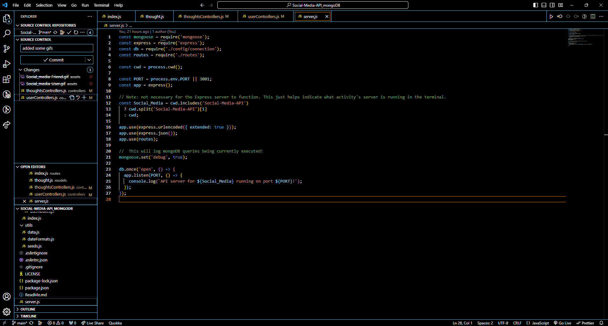
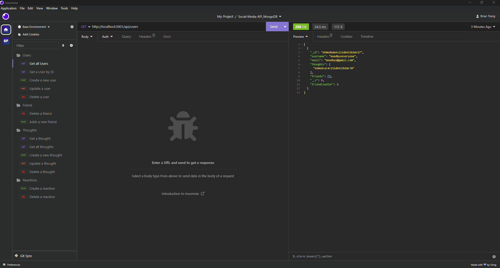
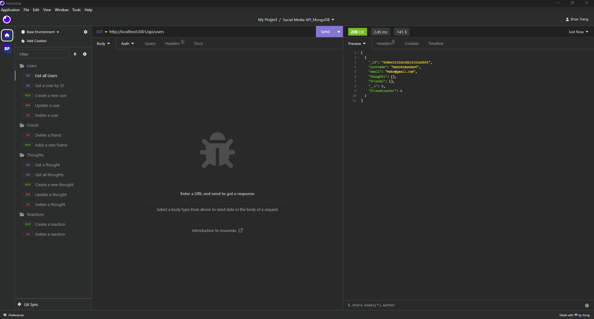
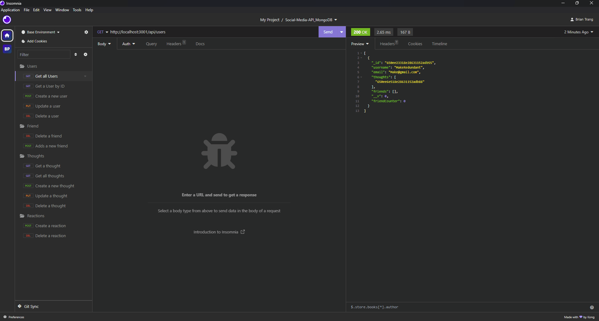

# Social-Media-API_mongoDB

## 📄 Description 
This is the API for a social media web application where users can share their thoughts, react to friends’ thoughts, and create a friend list. It uses Express.js for routing, a MongoDB database, and the Mongoose ODM. In addition to using the Express.js and Mongoose packages. Users can interact with API routes through Insomnia.

## 🪛 Technologies used 

<a href="https://expressjs.com/">Express.js</a>

<a href="https://www.mongodb.com/">MongoDB</a>

<a href="https://mongoosejs.com/">Mongoose</a>

<a href="https://insomnia.rest/">Insomnia</a>

<a href="https://nodemon.io/">Nodemon</a>

<a href="https://eslint.org/">ESLint</a>

<a href="https://prettier.io/">Prettier</a>

## 📓 Table of Contents
- [Installation](#%EF%B8%8FInstallation)
- [Usage](#Usage)
- [Screenshot](#%EF%B8%8FScreenshot)
- [Video](#Video)
- [License](#%EF%B8%8FLicense)
- [Contributing](#Contributing)
- [Tests](#%EF%B8%8FTests)
- [Questions](#Questions)
    
## 🖥️ Installation 

To verify the code on your local machine clone the code and run 

`npm install`

to install the dependencies 

run Nodemon (if any changes to the backend is made)

`npx nodemon`

and finally utilise insomnia to test API routes that are creating endpoints  
that respond to HTTP requests (GET, POST, PUT, DELETE).
## 💬 Usage 
Users can tests API routes which are defined with Express.js, where we are creating endpoints that respond  
to HTTP requests. These routes can handle various HTTP methods such as GET, POST, PUT, DELETE, etc.,  

## 🖼️ Screenshot

Gif of Users    
GET:Getting All users, GET:Get a user by ID, Post: Creating a new User, PUT: Updating a user, DEL:Deleting a user 

Gif of Friends
POST: Adding a new friend DELETE: Deleting a friend

Gif of Thoughts
GET:Getting All Thoughts, GET:Get a Thought by ID, Post: Creating a new Thought, PUT: Updating a Thought, DEL:Deleting a Thought

Gif of Reactions
POST: Adding a new Reaction DELETE: Deleting a Reaction

## 📹 Video
Screencastify
https://drive.google.com/file/d/1FKsgyWlPHvYjYHFZUZ6PVK3tK24dioa2/view 
## ⚖️ License 
This project is licensed under MIT
  
## 🤝 Contributing 
Brian Trang
With thanks to USYD
  
## 🛠️ Tests
N/A
 
## ❔ Questions
If you have any questions about this project, please contact me directly at brian.trang9@gmail.com. Feel free to view more of my projects at https://github.com/MakeRedundant.
